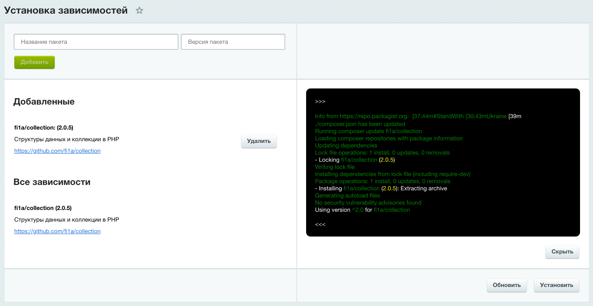
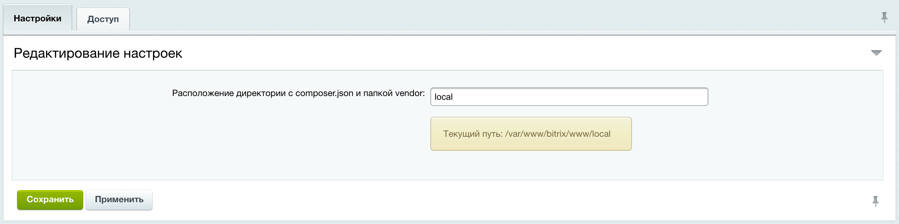

# Модуль 1С-Битрикс "Обертка над composer для установки зависимостей"

[![Software License][badge-license]][license]
[![Support mail][badge-mail]][mail]

Часто бывает так, что необходимо использовать в модуле пакет распростаняемый через composer. Простое включение
его в поставку с модулем не решает проблему так как может возникнуть ситуация, что два модуля включили один и тот же пакет два раза.
Данный модуль представляет собой обертку над composer и решает проблему путем
включения зависимостей модулей централизованно через composer.
Это можно сделать используя предоставляемый API при установке ваших модулей.

Также модуль имеет интерфейс с функцией управления зависимостями (добавления, обновления и удаления пакетов).
Данная возможность будет полезна при отсутствии доступа к консоли.

После установки модуль будет доступен в меню: Настройки > Установка зависимостей.

## Изображения модуля

Интерфейс управления зависимостями в админке 1С-Битрикс.



Настройки расположения домашней директории composer.



## Установка и удаление пакетов модуля

При установке вашего модуля можно вызвать метод `require` класса `Fi1a\BitrixRequire\ModulePackages`
для установки пакета через composer с указанной версией
(перед вызовом необходимо проверить установлен ли модуль "fi1a.bitrixrequire").

Пример:

```php
use Fi1a\BitrixRequire\ModulePackages;

$modulePackages = new ModulePackages();
$result = $modulePackages->require('fi1a.bitrixrequire', 'fi1a/format', '^2.0');
$result->isSuccess(); // true
```

Аргументы метода `require` класса `Fi1a\BitrixRequire\ModulePackages`:

| Аргумент                 | Описание                                       |
|--------------------------|------------------------------------------------|
| string $moduleId         | Идентификатор вашего модуля                    |
| string $package          | Название пакета от которого зависит ваш модуль |
| ?string $version = null  | Версия пакета                                  |

При удалении вашего модуля следует вызвать метод `remove` класса `Fi1a\BitrixRequire\ModulePackages`
для удаления информации о зависимости модуля от указанного пакета:

```php
use Fi1a\BitrixRequire\ModulePackages;

$modulePackages = new ModulePackages();
$result = $modulePackages->remove('fi1a.bitrixrequire', 'fi1a/format');
$result->isSuccess(); // true
```

Аргументы метода `remove` класса `Fi1a\BitrixRequire\ModulePackages`:

| Аргумент                 | Описание                                       |
|--------------------------|------------------------------------------------|
| string $moduleId         | Идентификатор вашего модуля                    |
| string $package          | Название пакета от которого зависит ваш модуль |

[badge-license]: https://img.shields.io/github/license/fi1a/bitrixvalidation?style=flat-square
[badge-mail]: https://img.shields.io/badge/mail-support%40fi1a.ru-brightgreen

[license]: https://github.com/fi1a/bitrixvalidation/blob/master/LICENSE
[mail]: mailto:support@fi1a.ru